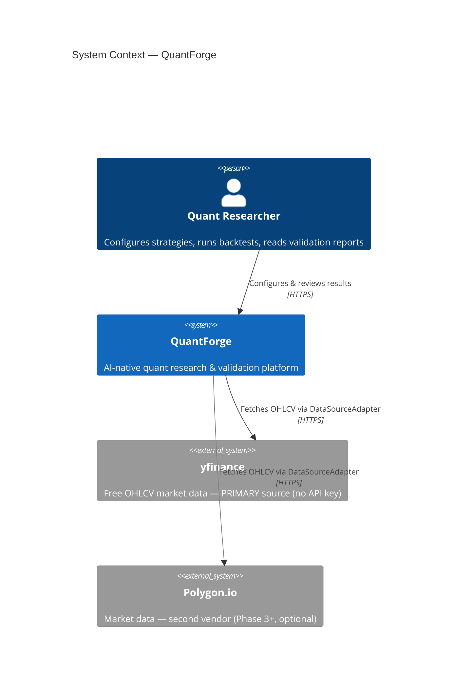
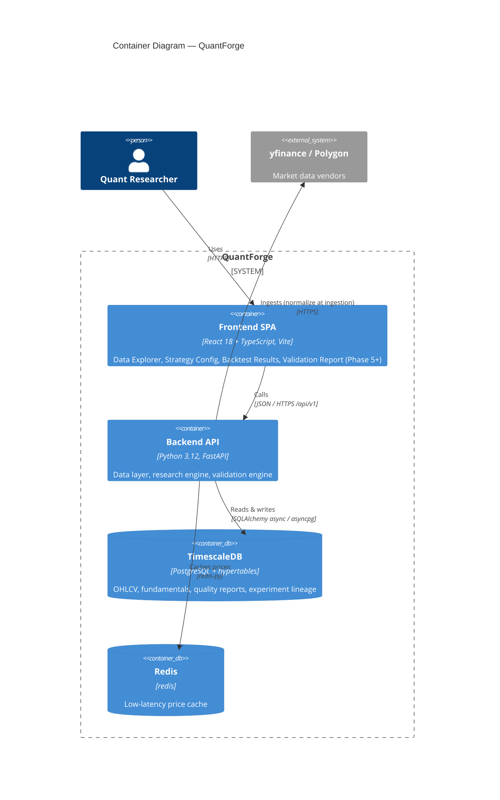
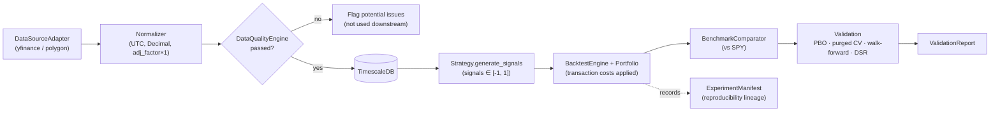
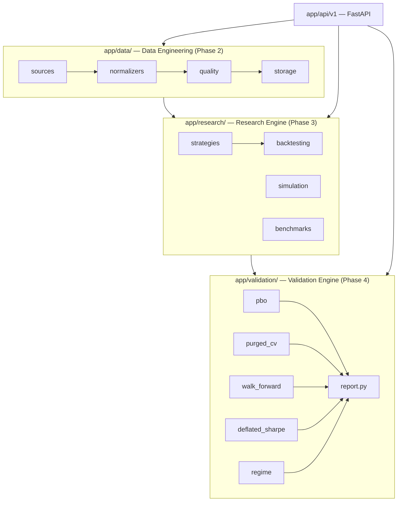

# QuantForge — C4 Architecture Diagrams

C4 model (Context → Container) plus the canonical data-flow pipeline. Rendered by any
Mermaid-aware viewer (GitHub, VS Code Mermaid extension).

## Level 1 — System Context

Who uses QuantForge and what it depends on.

## Level 2 — Containers

The deployable/runtime pieces. Frontend is Phase 5+; shown for completeness.

## Canonical Data Flow

The invariant pipeline (CLAUDE.md): every datum crosses the quality gate before any
research or validation component can use it.

## Component layering (within the Backend API)

